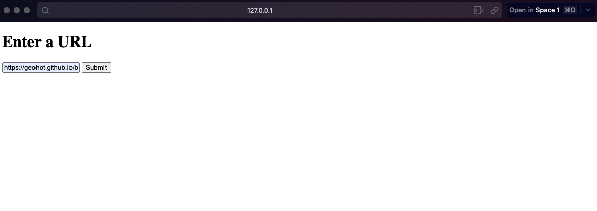
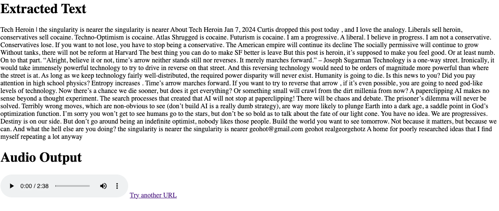

# Blog2Audio

Blog2Audio is a web application that converts blog posts into audio format. It allows users to input a URL of a blog post, and then it fetches the text, converts it into speech using OpenAI's Text-to-Speech service, and provides an audio version of the blog post for the user to listen to. It just runs locally as of now.

## Features

- Input field for users to submit the URL of a blog post.
- Text extraction from the blog post using Beautiful Soup.
- Text-to-Speech conversion using OpenAI's API.
- An audio player embedded in the webpage to play the converted audio.
- The user can also download the audio file, change playback speed, and control volume.

## UI/Results

## Next Steps

Host on a server so that it is very easy to use. Github only allows static pages and I don't want to pay to host one right now, but it does work well. Other features could be a better UI or a space where the user could enter the blogs they read the most and new audio versions of blogs would appear as they release.
